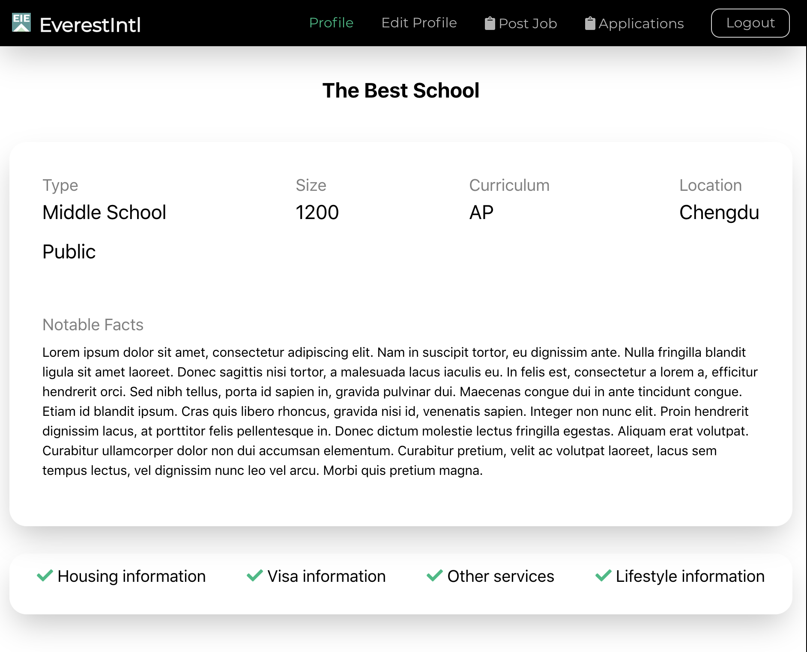

# Everest App [Live](https://everest-app.everest.now.sh/)

> Everest is an application for a client (Everest International Education) to handle applicants for teaching at schools in China. It has three types of main users, applicants/teachers, job posters/schools, and company/admins.

---
## Table of Contents
- [Main Features](#features)
- [Tech Used](#tech-used)
- [Server](#server)
- [Installation](#installation)
- [Documentation](#documentaion)
- [Tests](#tests)
- [Contributing](#contributing)
- [Team](#team)
- [License](#license)

---
## Features

### Teacher Profile


### School Profile


### Jobs Page


---

## Tech Used

> Client / Frontend
* React
* HTML
* CSS
* SASS
* React hooks

> Server / Backend
* Node
* Express
* Postgresql
* Bcrypt

> Deployment
* Heroku
* Zeit / Now

---
## Server

https://github.com/mengqi89/everest-api

## Installation
-Before set up server set up server: `git clone https://github.com/mengqi89/everest-api.git`

-Clone the repo: `git clone https://github.com/mengqi89/everest-client.git`

-Install dependencies: `npm install`

In the project directory, you can run:

### `npm start`

Runs the app in the development mode.<br>
Open [http://localhost:3000](http://localhost:3000) to view it in the browser.

The page will reload if you make edits.<br>
You will also see any lint errors in the console.

### `npm test`

Launches the test runner in the interactive watch mode.

---

## Documentation

A. Component Hierarchy
1. Everest uses React and React Router Dom to handle routes and rendering
> Hierarchy is as follows
  ```
  App
  Routes
  Components
  ```

B. Security and Authentication
  1. Everest uses JWT authentication and hashed passwords
  - passwords are not stored in database, only hash

C. Styling 
  1. Everest uses Sass and CSS for styling

---

## Tests

- Everest uses React's Jest tests for basic smoke and snapshot testing
- Each component folder contains a test for the component called  `componentName.test.js`

---

## Contributing

> To get started...

### Step 1

- **Option 1**
    - 🍴 Fork this repo!

- **Option 2**
    - 👯 Clone this repo to your local machine using `https://github.com/mengqi89/everest-app.git`

### Step 2

- **HACK AWAY!** 🔨🔨🔨

### Step 3

- 🔃 Create a new pull request using <a href="https://github.com/mengqi89/everest-app/compare" target="_blank">`https://github.com/mengqi89/everest-app/compare`</a>

---

## Team

- **[Mengqi Wang](https://github.com/Mengqi89)** - Project Manager, Developer
- **[Kyler Renneker](https://github.com/kylerRenneker)** - QA Lead, Developer
- **[Samantha Ambroise](https://github.com/sam-ilki)** - Program Manager, Developer
- **[Natalie Sun](https://github.com/nataliesun)** - Design Lead, Developer
---

## License

[](http://badges.mit-license.org)

- **[MIT license](http://opensource.org/licenses/mit-license.php)**
- Copyright 2019 © <a href="https://mengqi89.github.io/portfolio/" target="_blank">Everest International Education</a>.
